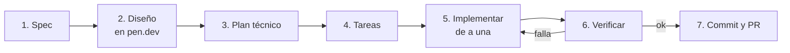

# Guía de flujo de trabajo: opencode + pen.dev con Vibe Engineering y SDD

Para: Meli. Primera tarea: **Fase 2, parte UI** (login, cambio obligatorio de contraseña, navegación por rol y perfil).
Las instrucciones de instalación y conexión salen de las docs oficiales de opencode y de pen.dev, consultadas el 21/9/2026. Si algo no coincide con lo que ves en pantalla, mandan las docs: [opencode](https://opencode.ai/docs) y [pen.dev](https://docs.pen.dev).

---

## 1. Qué es este flujo, en dos líneas

- **SDD (Spec-Driven Development):** primero se escribe qué se quiere (la _spec_), después cómo se hace (el _plan_), después la lista de pasos (las _tareas_). Recién ahí se escribe código. La spec es la fuente de verdad: si el código y la spec no coinciden, se corrige uno de los dos, nunca se ignora.
- **Vibe Engineering:** trabajar rápido y en confianza con el agente, pero con disciplina de ingeniería: le pedís cosas chicas, leés cada cambio antes de aceptarlo, verificás con `build`, `lint` y `test`, y commiteás seguido. Vibe coding es aceptar todo sin mirar; esto es lo contrario.



**Regla que ordena todo:** cada paso termina con vos leyendo lo que produjo el agente. El agente propone, vos decidís.

---

## 2. Instalación (una sola vez)

### 2.1 Requisitos previos

- Node 22 o superior y `git`. Verificá con `node -v` y `git --version`.
- Acceso al repo y a las cuentas: seguí la sección **Onboarding técnico** del plan de trabajo (GitHub, Supabase, Vercel con el email de Māra Labs).

### 2.2 Proyecto

```bash
git clone https://github.com/maralabs-2026/demoPos.git
cd demoPos
npm install
cp .env.example .env.local
```

Completá `.env.local` con `NEXT_PUBLIC_SUPABASE_URL` y `NEXT_PUBLIC_SUPABASE_ANON_KEY` (Supabase → Settings → API). Después, tu identidad para los commits, solo dentro de esta carpeta (sin `--global`):

```bash
git config user.name "Meli"
git config user.email "tu-email-real@ejemplo.com"
```

Comprobá que todo anda: `npm run build`, `npm run lint`, `npm run test`. Si algo falla acá, avisá antes de seguir: es un problema del entorno, no de tu tarea.

### 2.3 opencode

```bash
npm install -g opencode-ai
```

(Alternativas en Windows: `choco install opencode` o `scoop install opencode`.) Después:

1. Dentro de la carpeta del proyecto ejecutá `opencode`.
2. Escribí `/connect` y elegí el proveedor. Jordy te dice cuál usar y te pasa la clave por un canal directo. **Nunca pegues una clave en un prompt, en un archivo del repo ni en el chat del equipo.**
3. Elegí el modelo con `/models`.

### 2.4 pen.dev

1. Abrí VS Code o Cursor → Extensiones → buscá **pen.dev** → **Install**. (También hay app de escritorio en [pen.dev/downloads](https://www.pen.dev/downloads).)
2. Creá o abrí cualquier archivo que termine en `.pen`. Es un JSON, así que va al repo como cualquier otro archivo.
3. Si te pide iniciar sesión, usá la cuenta de Māra Labs y consultá con Jordy antes de aceptar planes o pagos.

### 2.5 Conectar opencode con pen.dev (MCP)

Según las docs, opencode está entre los clientes soportados. Pasos:

1. Con pen.dev abierto y **un archivo `.pen` abierto**, andá a **Settings (engranaje) → MCP**.
2. Activá **OpenCode CLI**.
3. Reiniciá `opencode` (cerralo y volvé a ejecutarlo en la carpeta del proyecto).
4. Verificá que en la lista de servidores MCP aparezca **`pencil`**.

Prerrequisito permanente: **pen.dev tiene que estar corriendo y con un `.pen` abierto** cada vez que quieras que el agente diseñe. Si `pencil` no aparece, casi siempre es eso.

### 2.6 Las reglas del proyecto ya las lee opencode (y una trampa)

El repo tiene `CLAUDE.md` con la arquitectura y las convenciones. opencode lo usa **automáticamente, siempre que no exista un `AGENTS.md`** en el proyecto.

- **No ejecutes `/init`.** Ese comando crea un `AGENTS.md`, y desde ese momento opencode **ignora `CLAUDE.md`** (solo usa el primero que encuentra).
- Si ya existe un `AGENTS.md`, borralo sin commitearlo y avisale a Jordy.
- Verificación rápida: dentro de opencode preguntá _"¿Qué reglas del proyecto tenés cargadas? Resumilas en 5 líneas"_. Tiene que mencionar módulos separados, RLS, voseo, acciones que devuelven `{ ok, data }` y no instalar dependencias sin avisar.

---

## 3. Los dos modos de opencode

Con **Tab** alternás entre:

- **Plan:** el agente lee y propone, pero no toca archivos. Se usa para spec, diseño de plan y revisión.
- **Build:** el agente edita archivos y corre comandos. Se usa para implementar.

Comandos útiles: `/undo` y `/redo` (se pueden repetir varias veces), `/new` (sesión limpia), `/models`, `/connect`.

**Regla práctica:** todo lo que sea pensar (pasos 1 a 4) en Plan; todo lo que sea escribir código (paso 5) en Build, **una tarea por vez**.

---

## 4. El flujo, paso a paso

Ejemplo real: tu primera tarea. Contexto: la Fase 2 completa conecta el login a Supabase Auth (semana 2). **Ahora vas a hacer solo la UI, con datos de prueba, sin llamar a Supabase.**

### Paso 0. Rama

```bash
git checkout main && git pull
git checkout -b feat/auth-ui
```

Nunca se trabaja sobre `main`.

### Paso 1. Spec (qué y por qué)

Creá `specs/fase-2-auth-ui/spec.md`. Podés escribirla vos o pedirle un borrador al agente **en modo Plan**:

> Leé `CLAUDE.md` (secciones 3, 4 y Fase 2). Armá un borrador de `specs/fase-2-auth-ui/spec.md` para la parte de UI de la Fase 2 usando la plantilla de la sección 6.1 de esta guía. No escribas código. Lo que no esté definido en `CLAUDE.md`, ponelo en "Preguntas abiertas"; no lo inventes.

Después **leela completa y corregila**. Una spec floja da código flojo.

Una buena spec tiene criterios de aceptación que se pueden comprobar con un sí o un no. Mal: _"el login se ve bien"_. Bien: _"En 360 px de ancho no hay scroll horizontal y el botón Ingresar es visible sin scrollear"_.

**Terminaste el paso cuando:** no quedan preguntas abiertas sin respuesta. Las dudas de negocio se las hacés a Jordy antes de seguir.

### Paso 2. Diseño en pen.dev

1. Creá `design/auth.pen` **dentro del repo**. La doc de pen.dev exige que el `.pen` esté en el mismo workspace que el código para que el agente vea ambos.
2. Con pen.dev abierto y `pencil` conectado, pedile al agente (Plan primero, para que te describa lo que va a hacer):

> Leé `specs/fase-2-auth-ui/spec.md` y `src/app/globals.css`. En `design/auth.pen` diseñá estas pantallas usando los colores, radios y tipografía que ya están en `globals.css`: Login, Cambiar contraseña (pantalla que ve quien ingresa con una contraseña temporal), Barra de navegación en sus 3 variantes (dueño, encargado, cajero) y Perfil. Cada pantalla en dos tamaños: 360 px y escritorio. Todos los textos en español rioplatense con voseo.

3. Mirá el resultado en el canvas y ajustalo a mano o iterando con el agente.

**Terminaste el paso cuando:** cada criterio de la spec que sea visual tiene un frame que lo muestra, en 360 px y en escritorio.

Guardá el `.pen` y commiteá: `git add design specs && git commit -m "docs(auth): add spec and design for phase 2 UI"`.

### Paso 3. Plan técnico (cómo)

En modo Plan:

> Con `spec.md` y `design/auth.pen`, escribí `specs/fase-2-auth-ui/plan.md`: qué archivos vas a crear o tocar y por qué, en 10 líneas o menos; decisiones técnicas; riesgos. Respetá la estructura de módulos de `CLAUDE.md`. No escribas código.

Leé el plan y verificá que:

- El código nuevo va en `src/modules/auth/` (`components/`, `schemas.ts`, y `actions.ts`/`queries.ts` solo si hacen falta).
- No aparece ninguna dependencia nueva. Si aparece, se frena: `CLAUDE.md` exige avisar y justificar antes de instalar.
- No toca `supabase/migrations/`. Eso es de la Fase 1, ya cerrada.

**Terminaste el paso cuando:** Jordy dio el OK al plan. La regla del proyecto es "plan corto y esperar el OK antes de escribir código".

### Paso 4. Tareas

En modo Plan:

> Convertí `plan.md` en `specs/fase-2-auth-ui/tasks.md`: una checklist ordenada de tareas, cada una de menos de 300 líneas, con "Hecho cuando" verificable y qué criterio de la spec cubre.

Ejemplo del formato esperado:

```md
- [ ] T1 Schemas Zod de login y de cambio de contraseña (email válido, contraseña mínima, confirmación igual). Cubre CA2. Hecho cuando: hay tests unitarios en verde.
- [ ] T2 Componente LoginForm con estados de error y carga. Cubre CA1, CA2. Hecho cuando: coincide con el frame de auth.pen.
- [ ] T3 Página /login. Hecho cuando: renderiza LoginForm y no rompe el build.
```

### Paso 5. Implementar, una tarea por vez

Pasá a modo **Build** (Tab) y trabajá así, tarea por tarea:

> Implementá **solo T1** de `specs/fase-2-auth-ui/tasks.md`. Seguí `spec.md`, `plan.md` y las reglas de `CLAUDE.md`. No hagas nada de otras tareas. Al terminar, corré `npm run lint` y `npm run test` y mostrame el resultado.

Después de **cada** tarea:

1. Leé el diff completo: `git diff`. Si no entendés una parte, preguntale al agente qué hace y por qué.
2. Si algo no te cierra: `/undo`, y corregí el prompt o la spec. No parches el código a mano sin actualizar la spec.
3. Tildá la tarea en `tasks.md`.
4. Commit chico, en inglés: `git commit -m "feat(auth): add login and recovery schemas"`.

**Trabajá en sesiones cortas:** una tarea o dos por sesión. Si el agente empieza a repetirse o a olvidarse cosas, abrí una sesión nueva con `/new`: la spec, el plan y las tareas están en archivos, así que no se pierde nada.

### Paso 6. Verificar

1. `npm run build`, `npm run lint` y `npm run test` sin errores.
2. `npm run dev` y abrí la pantalla **en 360 px y en escritorio** (las herramientas de desarrollador del navegador permiten simular el ancho). Compará contra `design/auth.pen`.
3. Recorré la lista de criterios de aceptación de la spec y tildá cada uno con evidencia (captura o resultado de comando).
4. Si un criterio falla, volvés al paso 5 con esa tarea, no reescribís todo.

Podés pedirle al agente una revisión en modo Plan, sin cambios:

> Revisá el diff de esta rama contra `spec.md` y `CLAUDE.md`. Listá incumplimientos: módulos importados sin pasar por `index.ts`, textos que no estén en voseo, `use client` innecesarios, dependencias nuevas, secretos. No edites nada.

### Paso 7. Cierre

1. Si durante el trabajo cambió algo respecto de la spec, **actualizá la spec** para que refleje la realidad.
2. `git push -u origin feat/auth-ui` y abrí un Pull Request contra `main`. Descripción: qué hiciste, qué criterios cubre, capturas en 360 px y en escritorio.
3. Actualizá tu fila en la tabla de **Estado** del plan de trabajo.
4. Esperá la revisión de Jordy. No hagas merge vos.

---

## 5. Alcance de tu primera tarea

**Sí:**

- Pantalla de login en `/login` (email y contraseña, errores genéricos: "Correo o contraseña incorrectos"), pantalla de cambio de contraseña para el primer ingreso, barra de navegación que cambia según el rol y perfil de solo lectura (nombre, correo, rol, comercio) con cierre de sesión.
- **Sin recuperación de contraseña por autoservicio y sin selector de comercio** (decisiones de Jordy): el blanqueo lo hace el dueño o el encargado, y el sistema es de un solo comercio.
- Datos de prueba en un archivo aislado, por ejemplo `src/modules/auth/mock.ts`, marcado con `// TODO(fase-2): reemplazar por Supabase Auth (semana 2)`.
- Validación con Zod, textos en voseo, componentes de servidor por defecto y `"use client"` solo donde hay interacción.

**No:**

- No llames a Supabase Auth ni toques `supabase/`. Eso es la semana 2.
- No cambies el diseño global (colores, tipografía): usá lo que hay en `globals.css`.
- No instales dependencias sin avisar y justificar.
- No crees `/reportes` ni `/config`: solo los links del menú según el rol (las pantallas llegan en fases posteriores).

**Menú por rol** (derivado de la sección "Roles" de `CLAUDE.md`; confirmalo con Jordy en la spec):

| Ítem      | Dueño | Encargado | Cajero |
| --------- | ----- | --------- | ------ |
| Vender    | Sí    | Sí        | Sí     |
| Productos | Sí    | Sí        | Sí     |
| Reportes  | Sí    | Sí        | No     |
| Config    | Sí    | No        | No     |
| Mi perfil | Sí    | Sí        | Sí     |

El ocultar links es solo comodidad: la barrera real de seguridad son las políticas RLS de la base y, en la semana 2, la protección de rutas.

---

## 6. Plantillas y prompts para copiar

### 6.1 Plantilla de `spec.md`

```md
# Spec: <nombre> (Fase X)

## Contexto

Por qué existe esto y qué parte de CLAUDE.md lo pide.

## Objetivo

Una o dos frases.

## Fuera de alcance

Lo que NO se hace en esta spec.

## Requisitos

- R1. ...
- R2. ...

## Criterios de aceptación (verificables)

- [ ] CA1. Dado ..., cuando ..., entonces ...
- [ ] CA2. ...

## Reglas del proyecto que aplican

Módulos, idioma, formato, errores, dependencias (de CLAUDE.md).

## Preguntas abiertas

- ... (quién responde)
```

### 6.2 Plantilla de `plan.md`

```md
# Plan: <nombre>

## Archivos a crear o tocar (10 líneas o menos)

1. `ruta` — por qué

## Decisiones técnicas

- ...

## Riesgos

- ...

## Cómo se verifica

- Qué comandos y qué pantallas se revisan
```

### 6.3 Comandos personalizados de opencode (opcional)

opencode permite guardar prompts como comandos en `.opencode/commands/<nombre>.md` (el nombre del archivo es el comando). Formato verificado en su doc: frontmatter con `description` y `agent`, y `$ARGUMENTS`. Ejemplo, `.opencode/commands/hacer.md`:

```md
---
description: Implementa una sola tarea de tasks.md
agent: build
---

Implementá solo la tarea $ARGUMENTS de los tasks.md de la carpeta specs que te indique.
Seguí spec.md, plan.md y CLAUDE.md. No hagas otras tareas.
Al terminar corré npm run lint y npm run test y mostrame el resultado.
```

Se usa así: `/hacer T1`. Si no lo necesitás todavía, saltealo: no cambia nada del flujo.

### 6.4 Prompts de bolsillo

| Situación                | Prompt                                                                                            |
| ------------------------ | ------------------------------------------------------------------------------------------------- |
| El agente se fue de tema | "Frená. Volvé a leer spec.md y decime qué parte de lo que hiciste no está pedida."                |
| No entendés un cambio    | "Explicame este diff línea por línea. ¿Qué pasa si lo sacamos?"                                   |
| Sospechás un bug         | "Escribí primero un test que falle por este bug. Después arreglalo."                              |
| Antes de cerrar la tarea | "Comparalo contra los criterios de aceptación y decime cuáles cumple y cuáles no, con evidencia." |

---

## 7. Errores comunes

| Error                                   | Consecuencia                                      | Qué hacer                                               |
| --------------------------------------- | ------------------------------------------------- | ------------------------------------------------------- |
| Ejecutar `/init`                        | Crea `AGENTS.md` y opencode ignora `CLAUDE.md`    | Borrar `AGENTS.md`, no commitearlo                      |
| Pedir "hacé todo el login"              | Diff enorme, imposible de revisar                 | Una tarea de `tasks.md` por vez                         |
| Aceptar cambios sin leerlos             | Bugs y reglas rotas que aparecen tarde            | `git diff` siempre, `/undo` si dudás                    |
| Pegar claves o contraseñas en un prompt | Quedan en el historial de la sesión               | Usar `.env.local` (git lo ignora); nunca pegar secretos |
| Usar `/share`                           | Publica la conversación completa de la sesión     | No usarlo: puede contener rutas, datos o claves         |
| Dejar la spec desactualizada            | El próximo prompt trabaja sobre información falsa | Actualizar la spec en el paso 7                         |
| Cerrar pen.dev o el `.pen`              | `pencil` desaparece de opencode                   | Abrir pen.dev con el `.pen` y reiniciar opencode        |
| Trabajar sobre `main`                   | Pisa el trabajo de los demás                      | Siempre una rama por tarea                              |
| `git push --force` o borrar historial   | Se pierde trabajo del equipo                      | No se usa                                               |

---

## 8. Definición de terminado (checklist de tu PR)

- [ ] La spec, el plan y las tareas están en `specs/fase-2-auth-ui/` y reflejan lo que se hizo.
- [ ] `design/auth.pen` está commiteado con las pantallas en 360 px y en escritorio.
- [ ] Todos los criterios de aceptación están tildados con evidencia.
- [ ] `npm run build`, `npm run lint` y `npm run test` pasan sin errores.
- [ ] No hay dependencias nuevas sin justificar, ni secretos, ni cambios en `supabase/`.
- [ ] Los datos de prueba están aislados y marcados con `TODO(fase-2)`.
- [ ] Commits chicos, en inglés, con formato `feat(auth): ...`.
- [ ] PR abierto contra `main` con capturas, y tu fila actualizada en el plan de trabajo.

---

## 9. Referencias

- [opencode: documentación](https://opencode.ai/docs), [reglas y `AGENTS.md`](https://opencode.ai/docs/rules/), [comandos](https://opencode.ai/docs/commands/), [servidores MCP](https://opencode.ai/docs/mcp-servers/)
- [pen.dev: instalación](https://docs.pen.dev/getting-started/installation), [integración con IA (MCP)](https://docs.pen.dev/getting-started/ai-integration), [de diseño a código](https://docs.pen.dev/design-and-code/design-to-code)
- `CLAUDE.md` en la raíz del repo: arquitectura, convenciones y fases.
